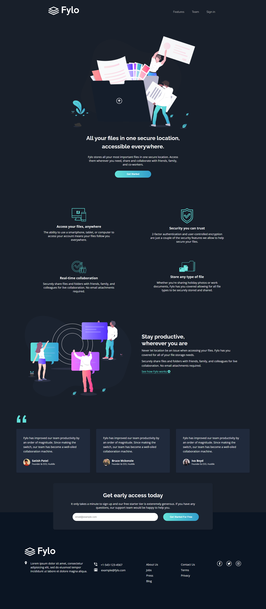

# Frontend Mentor - Fylo dark theme landing page solution

This is a solution to the [Fylo dark theme landing page challenge on Frontend Mentor](https://www.frontendmentor.io/challenges/fylo-dark-theme-landing-page-5ca5f2d21e82137ec91a50fd). Frontend Mentor challenges help you improve your coding skills by building realistic projects. 

## Table of contents

- [Overview](#overview)
  - [The challenge](#the-challenge)
  - [Screenshot](#screenshot)
  - [Links](#links)
- [My process](#my-process)
  - [Built with](#built-with)
  - [Useful resources](#useful-resources)
  
## Overview

### The challenge

Users should be able to:

- View the optimal layout for the site depending on their device's screen size
- See hover states for all interactive elements on the page

### Screenshot

### Links

- [GitHub Repo URL](https://github.com/adrvnc/fylo_landing_page)
- [Live Site URL](https://adrvnc.github.io/fylo_landing_page/)

## My process

### Built with
- HTML
- CSS
- 
### Useful resources

- [Column Layout](https://www.w3schools.com/howto/howto_css_four_columns.asp) - This helped me create a responsive four-column layout grid. The same principle can be applied to different grid layouts. 
- [Responsive Flexbox](https://www.w3schools.com/css/css3_flexbox_responsive.asp) - This is perfect for people who want to understand CSS Flexbox. 

